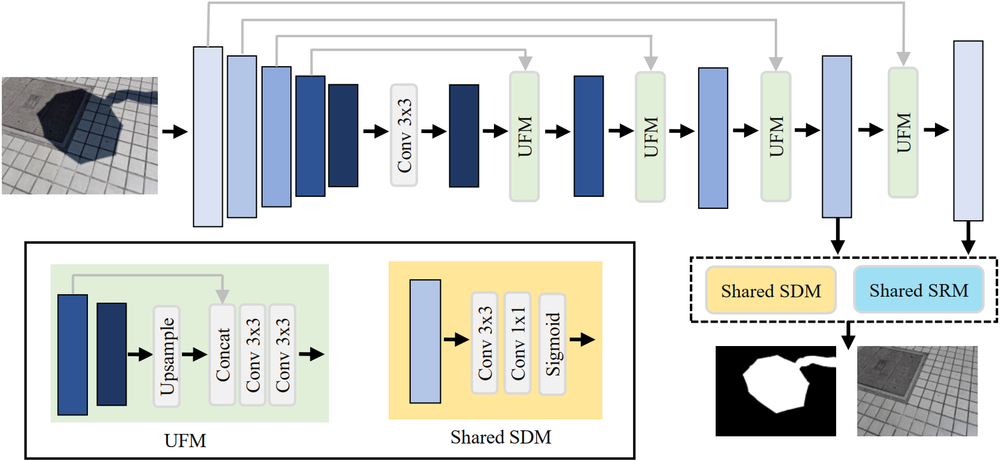
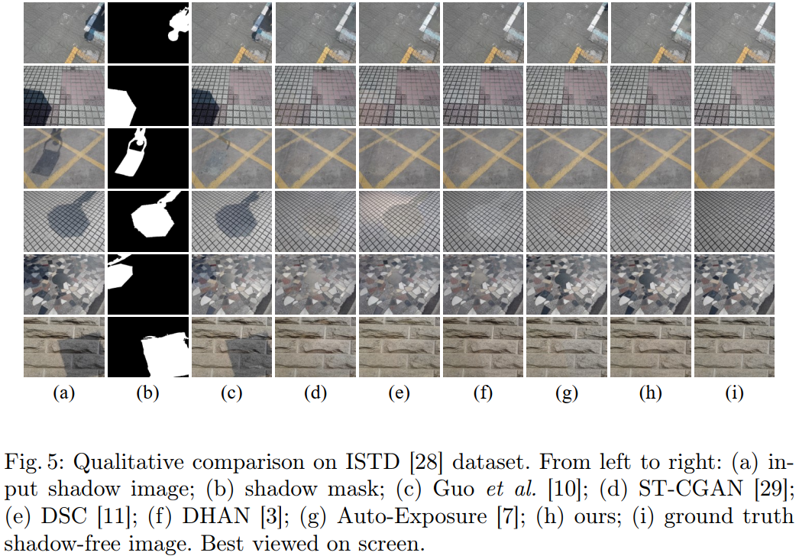

# MGRLN-Net (ACCV 2022)
Mask-Guided Residual Learning Network for Joint Single-Image Shadow Detection and Removal
<center></center>
MGRLN-Net is a deep learning architecture for joint single-image shadow detection and removal. If you find this project useful for your research, please cite:

```
@InProceedings{Jie_2022_ACCV,
    author    = {Jie, Leiping and Zhang, Hui},
    title     = {MGRLN-Net: Mask-Guided Residual Learning Network for Joint Single-Image Shadow Detection and Removal},
    booktitle = {Proceedings of the Asian Conference on Computer Vision (ACCV)},
    month     = {December},
    year      = {2022},
    pages     = {4411-4427}
}
```

## How to Use

### Installation
* Check out the source code ``` git clone https://github.com/LeipingJie/MGRLN-Net.git ```
* Install cuda 11.3, cudnn 8.2 and python 3.7 (settings of my enviornment, check yours by following)
``` 
    >>> import torch
    >>> print(torch.__version__)
    1.10.0+cu113
    >>> print(torch.version.cuda)
    11.3
    >>> print(torch.backends.cudnn.version())
    8200
    >>> 
``` 
* Install dependencies by ```pip install -r requirements.txt```

### Dataset
Three datasets are evaluated in our experiments: ISTD, AISTD (Adjusted ISTD Dataset, aka ISTD+) and SRD, download them and unzip each of them into individual directory. The structure looks like:
```

MGRLN-NET
    [data]
        [ISTD_Dataset]
            ......
        [AISTD_Dataset]
            ......
        [SRD]
            ......
    [dataset]
        ......
    [efficientnet]
        ......
    [model]
        ......
    [pretrained]
        last.ckpt
    config.py
    main.py
    test.py
    utils.py
    ......
```
* ISTD [click to download](https://github.com/DeepInsight-PCALab/ST-CGAN)
* AISTD [click to download](https://github.com/cvlab-stonybrook/SID)
* SRD (please email [the authors](http://vision.sia.cn/our%20team/JiandongTian/JiandongTian.html) to get assess) 

### Pretrained models & Results
Download pretrained model and the predictions from: [Click here to browser and download](
https://drive.google.com/drive/folders/160dH3QkSlbsi8UZ8nr4oA2Y__URF9mbQ?usp=share_link)

### Training
```
python main.py --gpus 0 --tag istd --dataset_name istd
```
dataset_name: istd, aistd or srd

### Testing
```
python test.py --tag istd --pretrained ./pretrained/last.ckpt
```

### Visualizations
<center></center>
